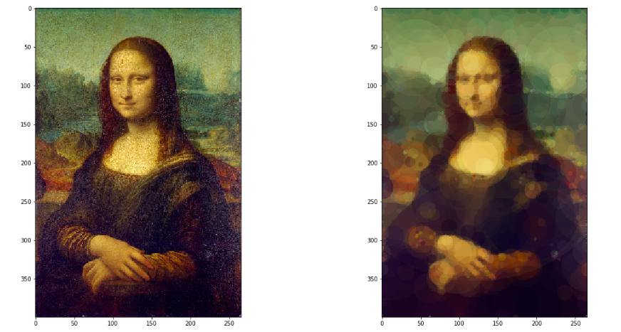
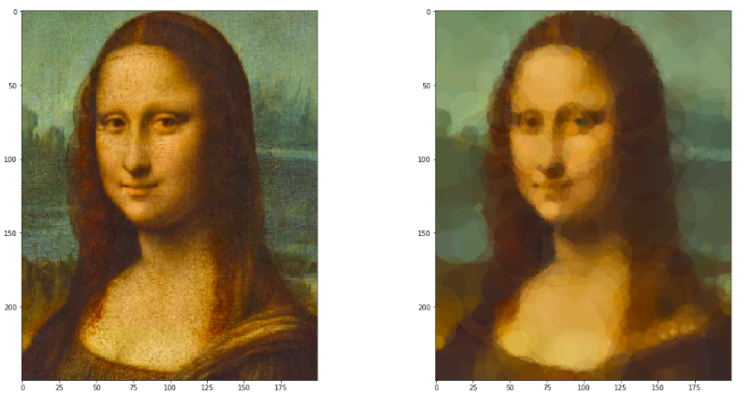

# MonaLisa
Evolutionary algorithms project

This is a report on a project for Evolutionary Algorithms course at University of Wroclaw. The task was to reconstruct given image by shapes found by the evolutionary algorithm. Constructed image should be similar to original image in a pixel difference sense.

